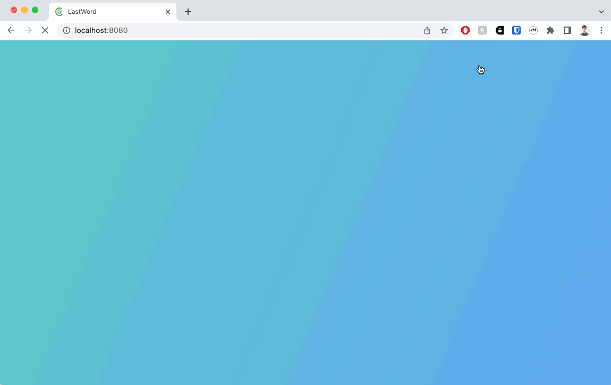

# LastWord

## ABOUT



Built in December 2022, my group capstone project for bootcamp. LastWord is a language-learning app that uses the IBM Watson API to offer scored live translation games. This project was an early learning experience in using git to bounce back from near-disasters in version control, continuous integration, and agile workflows.

This app uses the following technologies and frameworks:
Javascript, React.js, Redux, HTML/CSS, CSS Modules, Material UI, Node.js, Express.js, PostgreSQL, Sequelize, IBM Watson API, Render

## SETUP

To use this application, you'll need to take the following steps:

- Ensure that your local machine has Node.js and PostgreSQL installed.
- NODE.JS : the Node.js package can be downloaded using Homebrew with `brew install node`. Further instructions for different operating systems and methods can be found at (https://nodejs.dev/en/download/package-manager/).
- POSTGRESQL : on macOS, the PostgreSQL package can be installed using Homebrew with `brew install postgresql@14`. Further instructions can be found at (https://www.postgresql.org/download/)

- Clone this repo onto an empty directory on your local machine with `git clone git@github.com:lateral-neck-stretch/lastword.git`

- Once the repo has been cloned, install the necessary dependencies with `npm install`

- Create two PostgreSQL databases (one for test and one for development) with:

```
createdb lastword
createdb lastword-test
```

## START

### Building the database

- Sync and seed your database by running `npm run seed`.

### Running and using the application

- Run `npm run start:dev` start the server and build client-side files with webpack.

- Open your web browser and navigate to (http://localhost:8080/). For demo purposes, you can log in with the following dummy credentials created by the seed script:

  - _Username_: aaron / _Password_: 123
